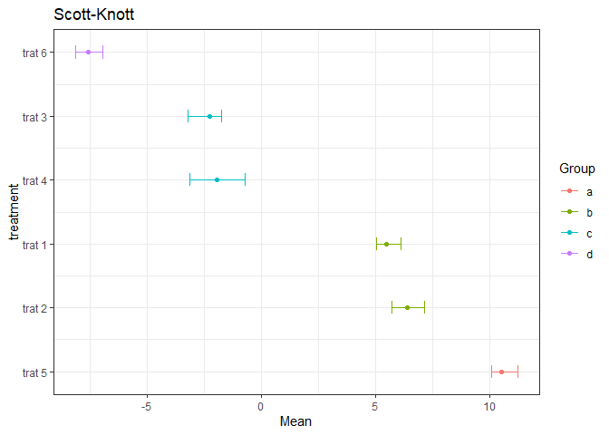

# USK

<!-- badges: start -->
<!-- badges: end -->

*usktest* is a function used to do the Scott-Knott cluster analysis
(1974) for unbalanced designs proposed at 2017 (CONRADO, T. V; FERREIRA,
D. F.; SCAPIM, C. A.; MALUF, W. R.). To learn more, see the article:
<http://ref.scielo.org/ws792m>.

## Installation

You can install the the development version from
[github](https://github.com/felipe179971/USK) with:

``` r
# install.packages("devtools")
devtools::install_github("felipe179971/USK",force = TRUE)
```

## Example

This is a basic example which shows you how to solve a common problem:

``` r
library(USK)
## basic example code
taus=c(4,4,-4,-4,9,-9)
treatment<-as.factor(rep(c(paste("trat",seq(1:length(taus)))),3))
error<-rnorm(3*length(taus),0,1)
y<-2+taus+error
y[round(runif(1,min=1,max=length(y)),0)]<-NA
dataset<-data.frame(y,treatment)

plot_usk(usktest(y~treatment,dataset,ANOVA = T))
#> [1] "##########################ANOVA###########################"
#>             Df Sum Sq Mean Sq F value   Pr(>F)    
#> treatment    5  625.4  125.07   146.4 1.12e-09 ***
#> Residuals   11    9.4    0.85                     
#> ---
#> Signif. codes:  0 '***' 0.001 '**' 0.01 '*' 0.05 '.' 0.1 ' ' 1
#> 1 observation deleted due to missingness
#> [1] "#######################Scott-Knott########################"
#> # A tibble: 6 x 5
#> # Groups:   treatment [6]
#>   treatment Group  Mean   min    max
#>   <fct>     <fct> <dbl> <dbl>  <dbl>
#> 1 trat 5    a     10.7  10.3  11.3  
#> 2 trat 1    b      6.28  5.98  6.45 
#> 3 trat 2    b      5.81  5.10  6.61 
#> 4 trat 4    c     -1.52 -3.30 -0.552
#> 5 trat 3    c     -3.09 -4.18 -2.00 
#> 6 trat 6    d     -6.37 -6.87 -6.01
```


